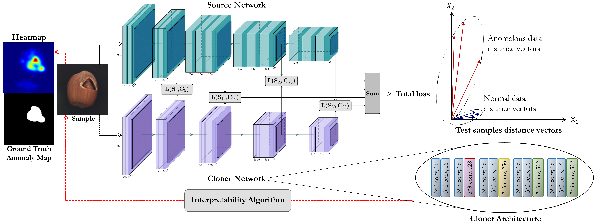

# Multiresolution Knowledge Distillation for Anomaly Detection

This repository contains code for training and evaluating the proposed method in our paper [Multiresolution Knowledge Distillation for Anomaly Detection](https://arxiv.org/pdf/2011.11108.pdf).



## Citation
If you find this useful for your research, please cite the following paper:
``` bash
@article{salehi2020distillation,
  title={Multiresolution Knowledge Distillation for Anomaly Detection},
  author={Salehi, Mohammadreza and Sadjadi, Niousha and Baselizadeh, Soroosh and Rohban, Mohammad Hossein and Rabiee, Hamid R},
  year={2020},
  eprint={2011.11108},
  archivePrefix={arXiv},
  primaryClass={cs.CV}
}
```

### 1- Clone this repo:
``` bash
git clone https://github.com/Niousha12/Knowledge_Distillation_AD.git
cd Knowledge_Distillation_AD
```
### 2- Datsets:
This repository performs Novelty/Anomaly Detection in the following datasets: MNIST, Fashion-MNIST, CIFAR-10, MVTecAD, and 2 medical datasets (Head CT hemorrhage and Brain MRI Images for Brain Tumor Detection).

Furthermore, Anomaly Localization have been performed on MVTecAD dataset.

MNIST, Fashion-MNIST and CIFAR-10 datasets will be downloaded by Torchvision. You have to download [MVTecAD](https://www.mvtec.com/company/research/datasets/mvtec-ad/), [Retina](https://www.kaggle.com/paultimothymooney/kermany2018), [Head CT Hemorrhage](http://www.kaggle.com/felipekitamura/head-ct-hemorrhage), and [Brain MRI Images for Brain Tumor Detection](http://www.kaggle.com/navoneel/brain-mri-images-for-brain-tumor-detection), and unpack them into the `Dataset` folder.


### 3- Train the Model:
Start the training using the following command. The checkpoints will be saved in the folder `outputs/{experiment_name}/{dataset_name}/checkpoints`.

Train parameters such as experiment_name, dataset_name, normal_class, batch_size and etc. can be specified in `configs/config.yaml`.
``` bash
python train.py --config configs/config.yaml
```

### 4- Test the Trained Model:
Test parameters can also be specified in `configs/config.yaml`.
``` bash
python test.py --config configs/config.yaml
```
